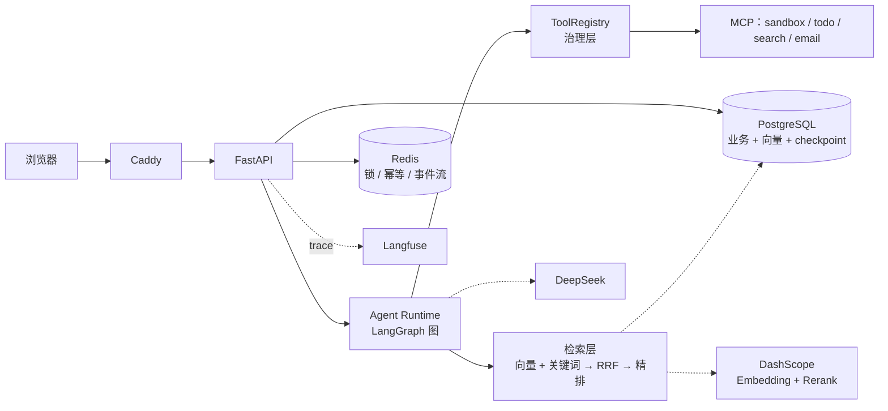

# Personal Agent OS

> 面向个人用户的多用户 AI 助理平台：**Agent 运行时 · 生产级 RAG · HITL 审批 · 全链路可观测**
> 前身是 StudyMate Agent（单机单用户、Chroma 单路检索的学习问答 demo），本项目是其**工程化演进**：把"能跑"做成"**在依赖故障、进程崩溃、用户关页面时仍然正确**"。

<!-- 演示动图：录制后替换本行（分镜与录制清单见 docs/demo/script.md） -->
<!--  -->

## 亮点（数字均为实测，可溯源）

| 能力 | 实测数字 | 证据 |
|------|---------|------|
| **混合检索**（pgvector 向量 + PostgreSQL 全文，RRF k=60） | nDCG@10 **0.9497 → 0.9567**、MRR@10 **+0.0147**（68 条评测集） | [评测报告](./docs/eval_report.md) |
| **精排**（qwen3.7-text-rerank） | MRR@10 **0.9240 → 0.9485**；代价：检索段 P95 207ms → 463ms | 同上 |
| **降级矩阵**（向量/关键词/精排三条链 + 显式角标） | 向量依赖故障时 Recall@10 **0.0000 → 0.9926**；验收中撞上两次真实故障（429 余额 / 403 额度）用户零中断 | [M6 手册](./M6_验收手册.md) |
| **中断恢复**（Postgres checkpoint + HITL 审批） | `docker kill` api 容器后，**新进程里批准并从断点续跑完成** | [M5 手册](./M5_验收手册.md) F3 |
| **多租户隔离**（RLS + 会话锁 + 幂等） | 跨租户访问返回 404（不泄露存在性）；安全用例进必过项 | [M1 手册](./M1_验收手册.md) |
| **CI 门禁** | 后端 ruff+mypy+pytest · 前端 tsc+build · 迁移可加载性 | [](https://github.com/yjwgq/StudyMate-Agent/actions/workflows/ci.yml) |

---

# 第一层：这是什么

一句话：**把四个"生产环境才会遇到"的问题，在个人项目规模上做成了可演示、可验证的闭环**。

| 问题 | 做法 | 怎么验证 |
|------|------|---------|
| 依赖会挂（限流/超时/欠费） | 三条降级链，任何一环失败都**显式标记 + 继续服务** | 关掉某个开关提问，页面出现"未精排 / 未走向量检索"角标 |
| 进程会死 | Agent 状态落 Postgres checkpoint，审批落库；**新进程可接着跑** | `kill -9` api 容器 → 重启 → 批准 → 任务继续完成 |
| 用户会关页面 | 执行与传输解耦（投递任务 + Redis Stream 事件订阅） | 发长任务 → 立刻关页面 → 重开，答案完整 |
| 危险动作不能自动执行 | 三级工具风险 + **参数级升级**（外发邮件 → L2 → 人工审批） | 让它给外部地址发邮件，弹审批卡片 |

**技术栈**：Python 3.12 · FastAPI（async + SSE）· LangGraph 1.2 · PostgreSQL 16 + pgvector（业务 + 向量 + checkpoint）· Redis · Celery · Next.js 15 · Caddy · Docker Compose

---

# 第二层：架构与快速开始

## 架构

完整架构图、SSE 时序、审批与崩溃恢复时序见 **[docs/architecture.md](./docs/architecture.md)**（Mermaid，GitHub 直接渲染）。



## 快速开始（30 分钟部署）

**前置**：Docker Desktop（或 Linux 的 docker + compose v2）、Git。CPU 即可（推理全部走云端）。

```powershell
# 1) 克隆 + 准备环境变量
git clone https://github.com/yjwgq/StudyMate-Agent.git && cd StudyMate-Agent
Copy-Item .env.example .env
```

编辑 `.env`，**必填项**：

| 变量 | 说明 |
|------|------|
| `LLM_API_KEY` / `LLM_MODEL` / `LLM_BASE_URL` | 生成模型（OpenAI 兼容；本项目用 DeepSeek） |
| `EMBED_API_KEY` / `EMBED_MODEL` / `EMBED_BASE_URL` | 向量模型（DashScope 兼容模式，**维度必须 1024**，与 DDL 一致） |
| `RERANK_API_KEY` / `RERANK_MODEL` / `RERANK_BASE_URL` | 精排模型（DashScope **原生** text-rerank 端点） |
| `JWT_SECRET` | `openssl rand -hex 32` 生成 |
| `POSTGRES_PASSWORD` | 自定；同时替换三条 `DATABASE_URL*` 里的 `CHANGE_ME` |
| `LANGFUSE_PUBLIC_KEY` / `LANGFUSE_SECRET_KEY` | 可选（不填则观测层自动 no-op，不影响功能） |

```powershell
# 2) 一条命令起栈（首次构建约 5–10 分钟，取决于网络与镜像源）
docker compose -f infra/docker-compose.dev.yml up -d --build

# 3) 按顺序验证（服务链：postgres → migrate → api → caddy/web）
curl http://localhost:8080/api/v1/health    # {"status":"ok"}
curl http://localhost:8080/api/v1/ready     # {"status":"ready"} —— 等它就绪再操作
```

| 地址 | 用途 |
|------|------|
| http://localhost:8080 | 对话（Agent 自动规划：普通问答走 RAG 引用，任务型走 DAG 并行 + 工具） |
| http://localhost:8080/kb | 知识库：上传 / 列表 / 入库进度 |
| http://localhost:8080/kb/debug | **检索调试台**：逐路分数（向量/关键词/RRF/精排）+ 生效开关 + 降级观察 |
| http://localhost:8080/api/v1/ready | 就绪检查（LLM / JWT / DB / Redis） |

**冒烟路径（5 分钟走完全链路）**：注册 → `/kb` 上传一份 PDF 或 Markdown → 等状态 `ready` → 回对话提问 → 答案带 `[1]` 脚注 → 去 `/kb/debug` 看逐路分数。

## 验收怎么跑

每个里程碑都有独立验收手册与**可重复执行的脚本**：

```powershell
bash scripts/ci_local.sh                      # 等价于 CI 的三道门禁（不需要栈）

# 端到端验收（需要栈 + 模型额度）
uv run python scripts/m3_acceptance.py        # D1–D5：引用 / groundedness / 租户隔离 / PII 脱敏
uv run python scripts/m4_acceptance.py        # E1–E8：DAG 并行 / 工具 / 循环检测 / 埋点 / 策略拒绝
uv run python scripts/m5_acceptance.py        # F1–F6：审批 / kill -9 恢复 / 关页面 / 取消 / 重生成
uv run python scripts/m6_acceptance.py        # G1–G4：混合检索对比 / 降级开关

# 测试分层
uv run pytest tests/unit -q                   # 单元（无外部依赖；含降级矩阵 / RRF / 脱敏）
uv run pytest tests/security -q               # 安全集成（需栈；RLS / 重放 / 并发 / 幂等）
uv run pytest tests/integration -q            # Agent 全图（fake LLM，不烧额度）
```

## 进度

| 里程碑 | 内容 | 状态 |
|--------|------|------|
| M0 | 端到端最小闭环（浏览器 → FastAPI → LLM → SSE 逐字回流） | ✅ A1–A6 |
| M1 | 基础设施与多租户认证（compose 编排 / 16 张表 / JWT+RLS / 会话锁 / 幂等） | ✅ B1–B8 |
| M2 | 知识库入库管线（上传校验 / PyMuPDF / 父子分块 / 千问向量化 / Celery） | ✅ C1–C7 |
| M3 | 单路 RAG + 可观测 + 评测基建（引用 / Langfuse + PII 脱敏 / golden + 噪声地板） | ✅ D1–D7 |
| M4 | Agent 运行时（planner DAG 并行 / ReAct 四终止 / 工具治理 / MCP / checkpointer） | ✅ E1–E8 |
| M5 | HITL 审批 + 流式健壮性（审批闭环 / 解耦 / kill -9 恢复 / 取消与重生成） | ✅ F1–F6 |
| M6 | 生产级 RAG + 降级矩阵（混合检索 / RRF / 精排 / 三条降级链与角标） | ✅ G1–G4 |
| M7 | 评测对比 + CI 门禁（真实语料扩集重标 / 对比与归因 / GitHub Actions） | ✅ H1–H3 |
| M10 | 收尾与交付资产（三层 README / 12 条 ADR / 架构图 / 评测报告 / demo 分镜与准备脚本 / 简历 bullet） | ✅ 交付资产完成；K1 新机部署与 K3 视频待执行 |

---

# 第三层：深入

| 文档 | 内容 |
|------|------|
| [**评测报告**](./docs/eval_report.md) | 方法论 · 噪声地板（σ=0）· 两代评测集 · 五管线对比与**逐项归因** · 限制与后续（P0 交付物） |
| [**架构与关键时序**](./docs/architecture.md) | 组件图 · 检索降级链 · SSE 两步流 · 审批与崩溃恢复 · RLS 数据流 |
| [**ADR 索引**](./docs/adr/README.md) | 12 条决策（9 条设计期 + 3 条实现期新增），每条含**替代方案与代价**及与设计文档的差异 |
| [**验收手册**](./M1_验收手册.md) | M1–M7 逐里程碑：验收读数 + **实测发现的缺陷与修复**（[M1](./M1_验收手册.md) · [M2](./M2_验收手册.md) · [M3](./M3_验收手册.md) · [M4](./M4_验收手册.md) · [M5](./M5_验收手册.md) · [M6](./M6_验收手册.md) · [M7](./M7_验收手册.md)） |
| [**实施计划**](./项目实施计划.md) | 里程碑 / 任务分解 / 验收标准 / 进度追踪 |
| [设计文档](./docs/design/PersonalAgent_设计文档_v1.1.md) | v1.2 范围收敛版：架构、ADR、DDL、协议 |
| [**演示脚本**](./docs/demo/script.md) | 3 分钟 demo 的分镜与录制清单 |

## 工程取舍（面试最常被追问的三条）

1. **为什么用 `ts_rank_cd` 而不是 BM25？** —— PostgreSQL 原生不支持中文分词，本项目用 jieba 分词写 `content_tokens` 再生成 `tsv`；`ts_rank_cd` 没有文档长度归一化与 k1/b，**我们明确不声称这是 BM25**。要 BM25 需引入 ParadeDB 或独立 Tantivy，代价是多一个组件（[ADR-0002](./docs/adr/0002-storage-pgvector.md)）。
2. **为什么选 pgvector 而不是 Milvus/Chroma？** —— 业务数据与向量同库同事务（避免"向量写成功但状态没更新"），少一个状态服务；代价是必须在应用层解决中文分词与**多租户过滤下的 HNSW 召回问题**（[ADR-0002](./docs/adr/0002-storage-pgvector.md)）。
3. **`docker kill` 之后任务为什么还能继续？** —— 执行与传输解耦：任务投递后由后台推进，事件写 Redis Stream，Agent 状态落 Postgres checkpoint；审批是**数据**（`approvals` 表）而不是内存状态（[ADR-0010](./docs/adr/0010-execution-transport-decoupling.md)）。

## 目录结构

```
apps/api/      FastAPI 接入层（core / api.v1 / repositories）
apps/web/      Next.js 前端（对话 / 知识库 / 检索调试台）
agent/         Agent 运行时（graph 编排 · tools 治理 · retrieval 检索 · obs 观测 · guardrails 护栏）
mcp_servers/   自建 MCP 工具服务（sandbox / todo / search / email）
worker/        Celery 异步任务（ingest 队列，同步 psycopg3）
infra/         容器编排 · 镜像 · 迁移（alembic）· DB 初始化
evals/         评测集 · 指标 · 对比与归因脚本 · 原始报告
docs/          架构图 · ADR · 评测报告 · demo 脚本 · 设计文档
scripts/       验收脚本 · CI 本地等价 · checkpoint 建表
```

## 未纳入范围（如实列出）

三级记忆系统 · 查询改写（HyDE）· RAGAS 答案层指标 · Prometheus/Grafana 面板 · 成本聚合告警 · MCP 工具 marketplace。
完整清单与原因见 [ADR 索引的"未纳入范围"表](./docs/adr/README.md)。
