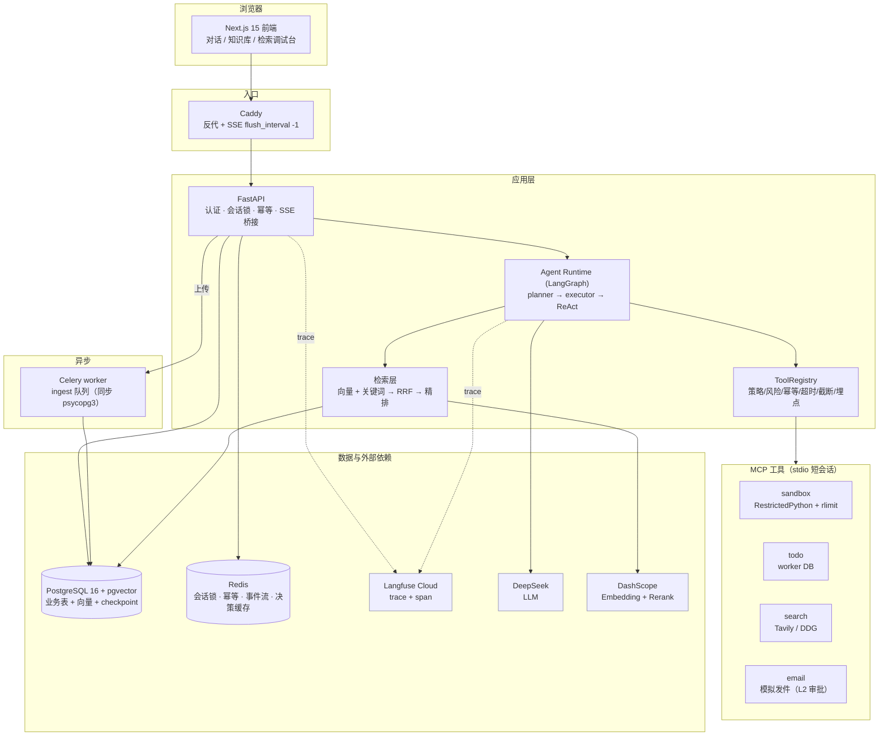
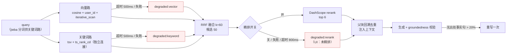
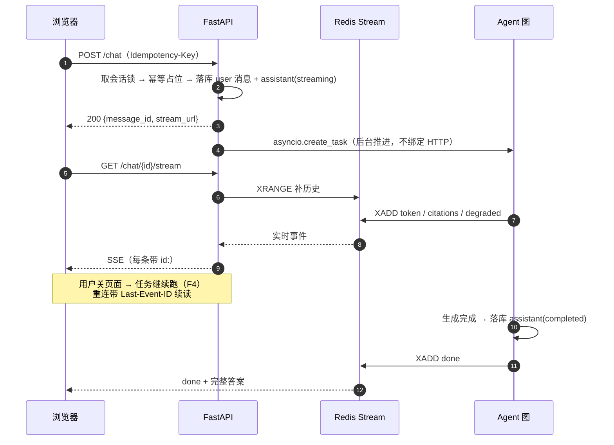
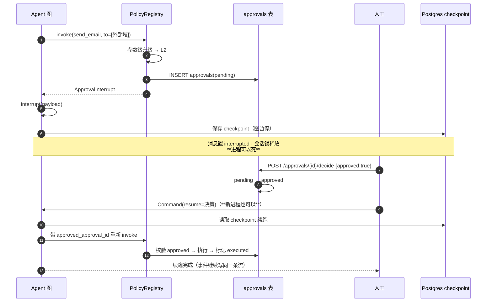
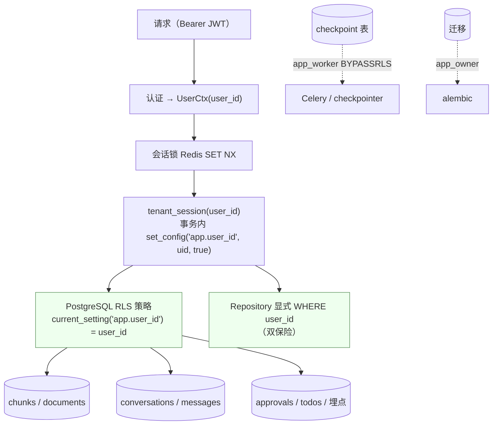
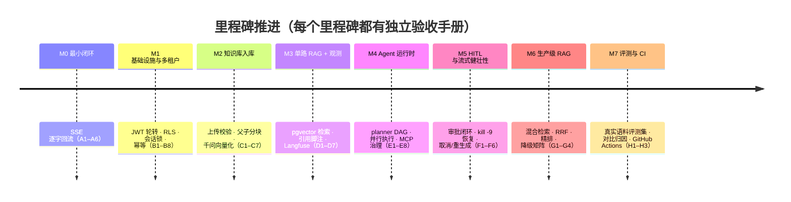

# 架构与关键时序

> 本文件是交付物"架构图 / 时序图"（设计文档 §20 P1）。
> 用 Mermaid 编写：GitHub 原生渲染、纯文本可 diff、不需要额外的图片工具链。

## 1. 组件图

## 2. 检索管线与降级分支（M6）

## 3. SSE 两步流时序（ADR-10）

## 4. HITL 审批与进程崩溃恢复时序（M5 的 F1/F3）

## 5. 多租户数据隔离（ADR-9）

**读法**：普通租户流量走 `app_api`（受 RLS 约束，且 SQL 里再显式带 `user_id`）；
后台跨租户任务走 `app_worker`（BYPASSRLS）；DDL 走 `app_owner`。跨租户访问返回 **404 而非 403**——不泄露资源是否存在。

## 6. 里程碑与验收（速览）

